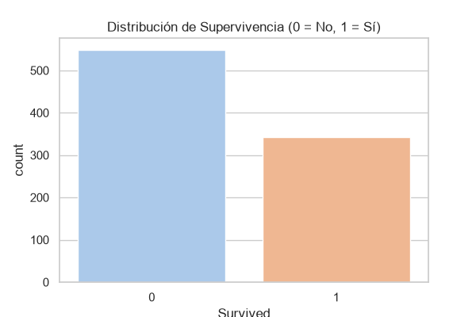
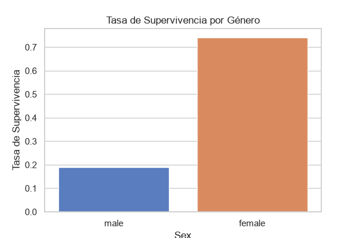
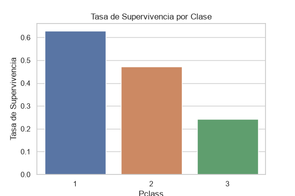
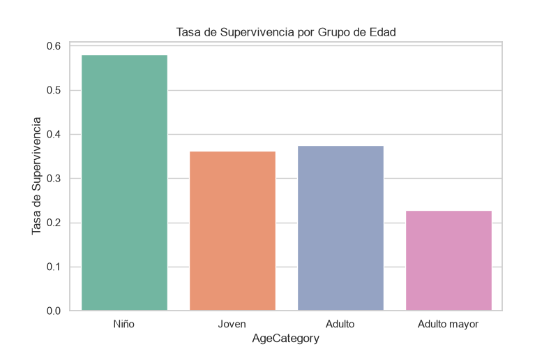

# Titanic
# Análisis de Pasajeros del Titanic
Este proyecto realiza un Análisis Exploratorio de Datos (EDA) sobre el dataset histórico de los pasajeros del Titanic, con el objetivo de identificar qué características demográficas y de viaje estuvieron asociadas con una mayor tasa de supervivencia.

## Dataset
* **Nombre:** Titanic.csv
* **Fuente:** [Kaggle]
* **Descripción:** Contiene información demográfica y de viaje de 891 pasajeros a bordo del Titanic, incluyendo estado de supervivencia, edad, género, clase de billete, etc.

## Requisitos
Para ejecutar este proyecto de forma aislada y reproducible, necesitas tener instalado Python 3.8+ y las bibliotecas especificadas en `requirements.txt`.

## Instrucciones de Instalación y Ejecución
Sigue estos pasos para reproducir el proyecto:

1. **Clonar el repositorio:**
   ```bash
   git clone [https://github.com/the-jp7/titanic.git]
   cd titanic-titanic
   crear un entorno vitual python -m venv .venv
   activarlo e instalar dependencias pip install -r requirements.txt
   debes ejecutar el archivo python src/itanic.py

**Análisis Realizados y Tratamiento de Datos Limpieza de Datos**
**Edad (Age)**: Se imputaron 177 valores nulos utilizando la mediana de la variable (28 años), para reducir el impacto de valores atípicos.

**Puerto de Embarque (Embarked)**: Se imputaron 2 valores faltantes utilizando la moda (S - Southampton).

**Cabina (Cabin)**: Dado que contenía más del 75% de valores nulos, la columna se eliminó del dataset principal, pero se conservó una variable binaria (HasCabin) para capturar la presencia de registro de cabina.

**Variables Creadas**
**FamilySize**: Calculada como SibSp + Parch + 1 para representar el tamaño total del grupo familiar del pasajero.

**AgeCategory**: Agrupación categórica de la edad en rangos:

Niño: 0 a 12 años
Joven: 13 a 25 años
Adulto: 26 a 60 años
Adulto mayor: Mayor a 60 años

## Resultados y Visualizaciones

### 1. Tasa de Supervivencia General
El **38.38%** de los pasajeros a bordo lograron sobrevivir.



### 2. Tasa de Supervivencia por Género
Las mujeres registraron una tasa del **74.20%**, en contraste con el **18.89%** de los hombres.



### 3. Tasa de Supervivencia por Clase de Pasajero
Los pasajeros de 1ª clase alcanzaron un **62.96%**, los de 2ª clase un **47.28%** y los de 3ª clase un **24.24%**.



### 4. Tasa de Supervivencia por Categoría de Edad
Los niños (0–12 años) tuvieron la tasa más alta de supervivencia (**57.97%**), mientras que los adultos mayores (>60 años) registraron la menor (**22.73%**).



**Hallazgos Clave**
Prioridad por género: Las mujeres tuvieron una probabilidad de supervivencia casi 4 veces mayor que los hombres (74.20% vs 18.89%), reflejando la aplicación del protocolo "mujeres y niños primero".

Impacto socioeconómico: Los pasajeros de 1ª clase tuvieron una tasa de supervivencia del 62.96%, frente al 24.24% registrado en 3ª clase.

Prioridad por edad: El grupo de niños presentó la tasa de supervivencia más alta por rango de edad (57.97%), mientras que los adultos mayores registraron la tasa más baja (22.73%).